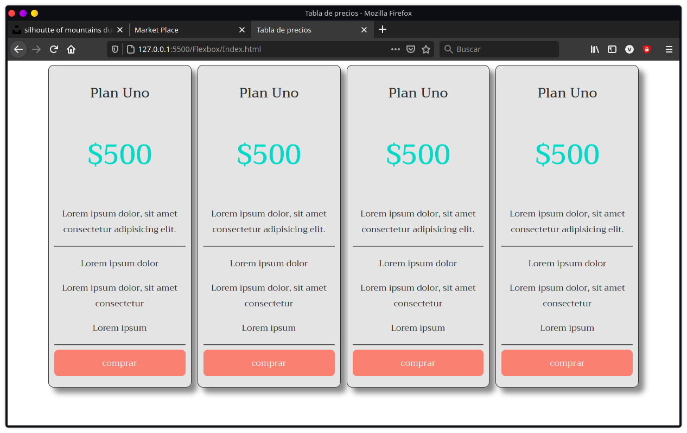
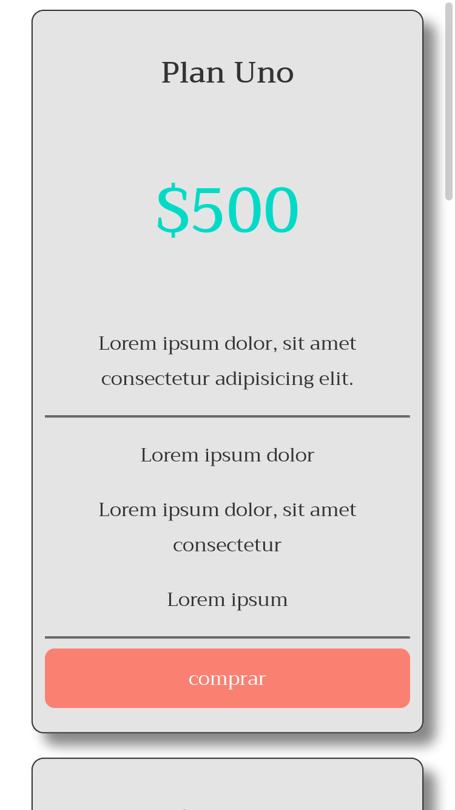

# CURSO DE HTML + CSS - FLEXBOX  👽

´´´
Curso de para practicar CSS y HTML e incluir un diseño responsive con Flexbox. 🤖
´´´

# SCREENSHOT 📲

por [JoseVale99](https://gist.github.com/JoseVale99) 😉
